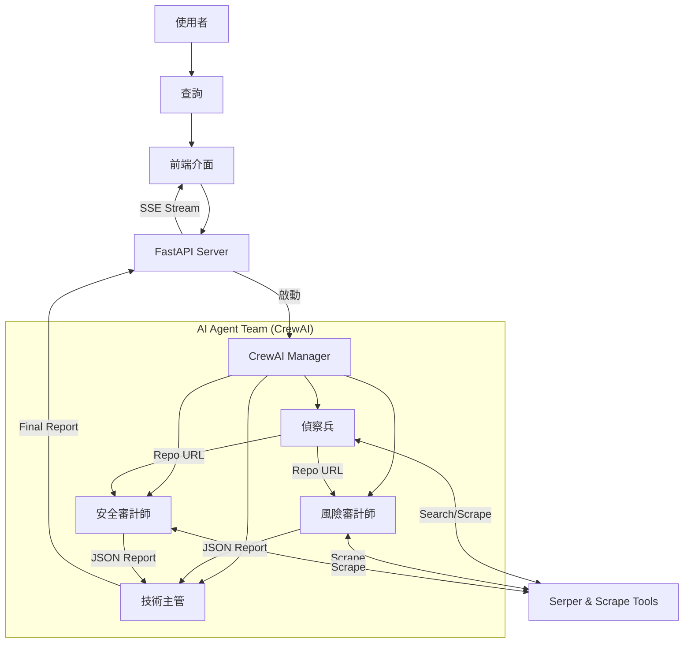

# 🛡️ OSS Guardian - AI 驅動的開源軟體盡職調查系統


[](https://hub.docker.com/r/jacob860818/ossguardian)


**OSS Guardian** 是一個基於 AI Agent 的自動化開源軟體盡職調查系統。它利用多個專門的 AI 代理人（Agents）協作，針對使用者查詢的開源專案進行全方位的分析，包括受歡迎程度、風險評估、安全性審計，並最終生成一份專業的盡職調查報告。

## 🌟 特色

- **多代理人協作**：
  - 🕵️ **偵察兵 (Scout)**：尋找最相關的 GitHub 倉庫。
  - ⚖️ **風險審計師 (Risk Auditor)**：評估專案健康度（Stars, Issues, License, Commit Date）。
  - 🔒 **安全審計師 (Security Auditor)**：檢查潛在的安全漏洞與風險。
  - 📝 **技術主管 (CTO)**：綜合所有資訊，生成繁體中文的盡職調查報告。
- **即時串流分析**：透過 Server-Sent Events (SSE) 即時顯示分析進度。
- **PDF 報告生成**：一鍵下載專業的 PDF 評估報告。
- **Gemini 驅動**：全面採用 Google Gemini 模型，提供強大的分析能力。
- **容器化部署**：支援 Docker 快速部署。

## 🏗️ 系統架構



## 🚀 快速開始

### 環境變數設定

1. **建立設定檔**
   請將 `.env.example` 複製為 `.env`：
   ```bash
   cp .env.example .env
   ```

2. **填入 API Key**
   編輯 `.env` 檔案，填入以下必要的 API Key：

```ini
# Google Gemini API Key (必要)
GEMINI_API_KEY=your_gemini_api_key_here
GEMINI_MODEL_NAME=gemini/gemini-2.5-flash

# Serper Dev Tool API Key (搜尋用，必要)
SERPER_API_KEY=your_serper_api_key_here
```

### 方式一：使用 Docker (推薦)

我們已經將映像檔發布至 Docker Hub，您可以直接拉取並執行。

1. **拉取映像檔**
   ```bash
   docker pull jacob860818/ossguardian:latest
   ```

2. **執行容器**
   
   **方法 A：直接傳入環境變數 (最快)**
   無需建立設定檔，直接透過 `-e` 參數傳入 API Key：
   ```bash
   docker run -d -p 8001:8001 \
     -e GEMINI_API_KEY="your_gemini_key" \
     -e GEMINI_MODEL_NAME="gemini/gemini-2.5-flash" \
     -e SERPER_API_KEY="your_serper_key" \
     --name ossguardian jacob860818/ossguardian:latest
   ```

   **方法 B：使用 .env 檔案 (推薦)**
   若您希望管理設定檔，請先在當前目錄建立一個 `.env` 檔案，內容如下：
   ```ini
   GEMINI_API_KEY=your_gemini_key
   GEMINI_MODEL_NAME=gemini/gemini-2.5-flash
   SERPER_API_KEY=your_serper_key
   ```
   然後執行：
   ```bash
   docker run -d -p 8001:8001 --env-file .env --name ossguardian jacob860818/ossguardian:latest
   ```

3. **訪問服務**
   打開瀏覽器前往 [http://localhost:8001](http://localhost:8001)

### 方式二：本地開發 (使用 uv)

本專案使用 `uv` 進行套件管理。

1. **Clone 專案**
   ```bash
   git clone https://github.com/Jacobyang0818/oss_guardian.git
   cd oss_guardian
   ```

2. **安裝依賴**
   ```bash
   uv sync
   ```

3. **執行服務**
   ```bash
   uv run main.py
   ```
   服務將啟動於 `http://0.0.0.0:8001`。

## 🛠️ 開發指南

### 專案結構

```
oss_guardian/
├── fonts/
├── src/
│   ├── api/          # FastAPI 路由與伺服器邏輯
│   ├── crew/         # CrewAI Agents, Tasks, Manager 定義
│   ├── static/       # 前端靜態檔案 (HTML, CSS, JS)
│   └── utils/        # 工具函式 (PDF 生成等)
├── tests/            # 測試程式碼
├── main.py           # 程式進入點
├── Dockerfile        # Docker 建置檔
├── pyproject.toml    # 專案依賴設定
└── uv.lock           # 依賴鎖定檔
```

### 執行測試

我們提供了完整的端到端測試腳本：

```bash
uv run test_gemini_full.py
```

## 🤝 貢獻

歡迎提交 Pull Request 或 Issue！

1. Fork 本倉庫
2. 建立您的 Feature Branch (`git checkout -b feature/AmazingFeature`)
3. 提交您的變更 (`git commit -m 'Add some AmazingFeature'`)
4. 推送到 Branch (`git push origin feature/AmazingFeature`)
5. 開啟 Pull Request

## 📄 授權

本專案採用 [MIT License](LICENSE) 授權。
